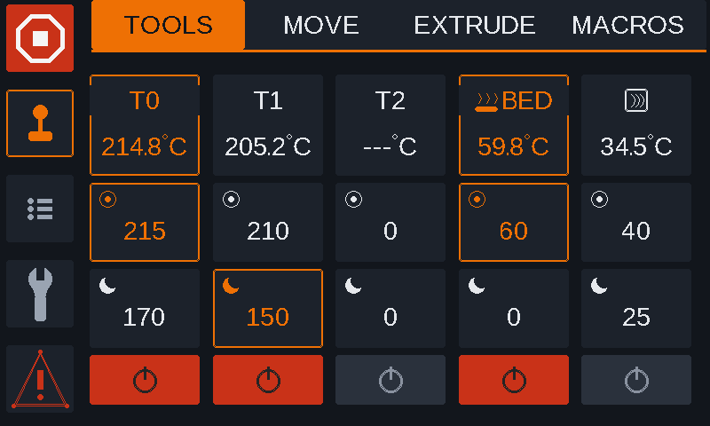
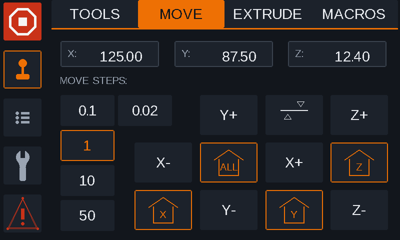
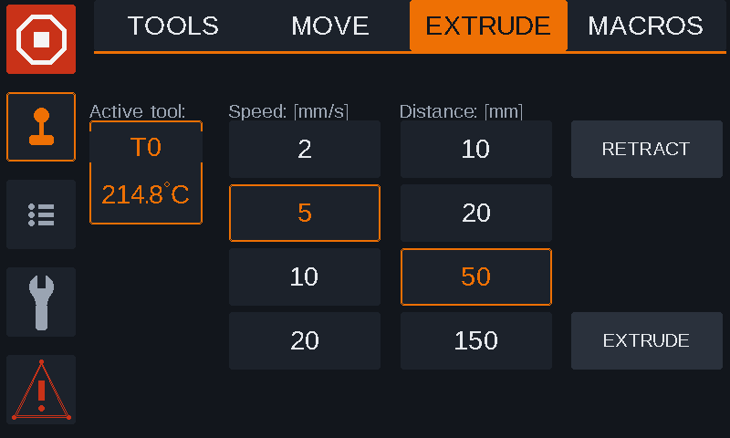
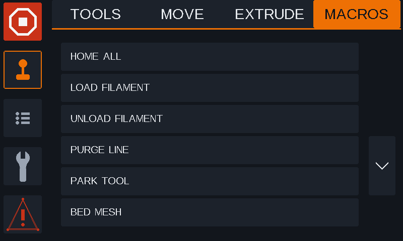
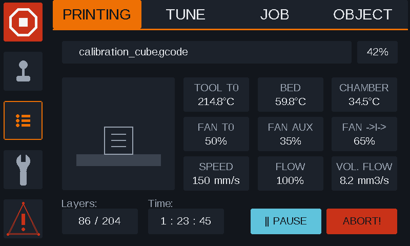
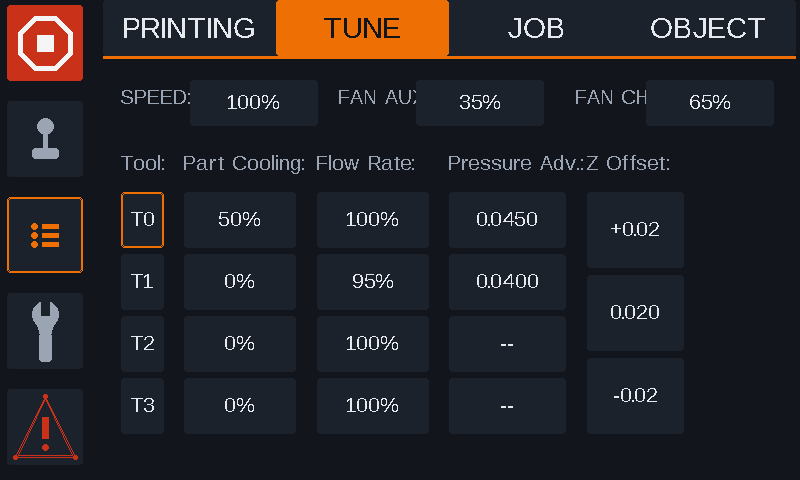
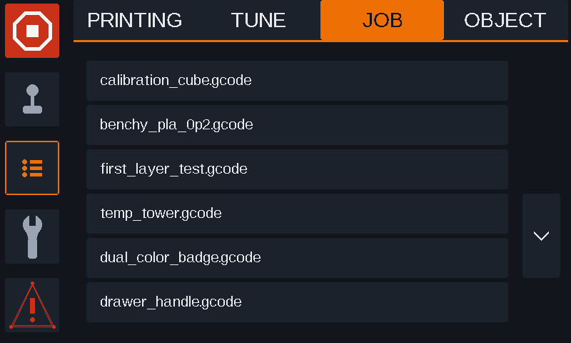
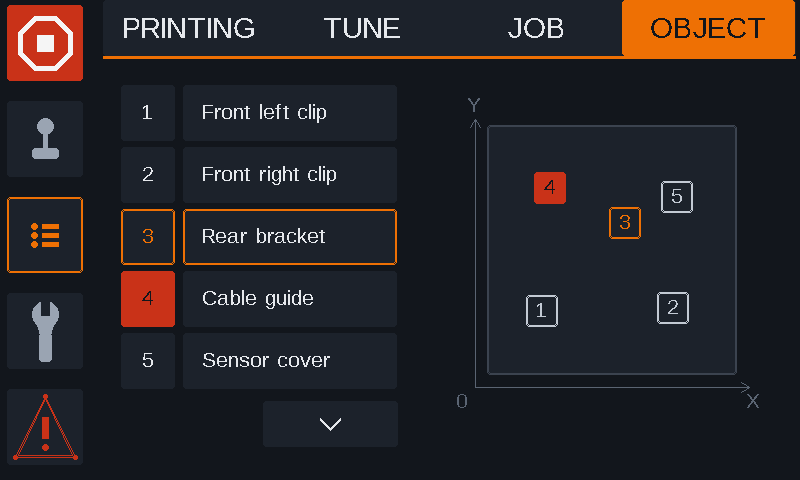
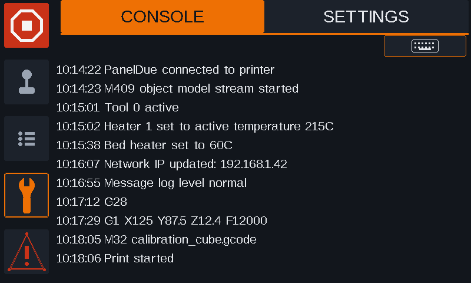
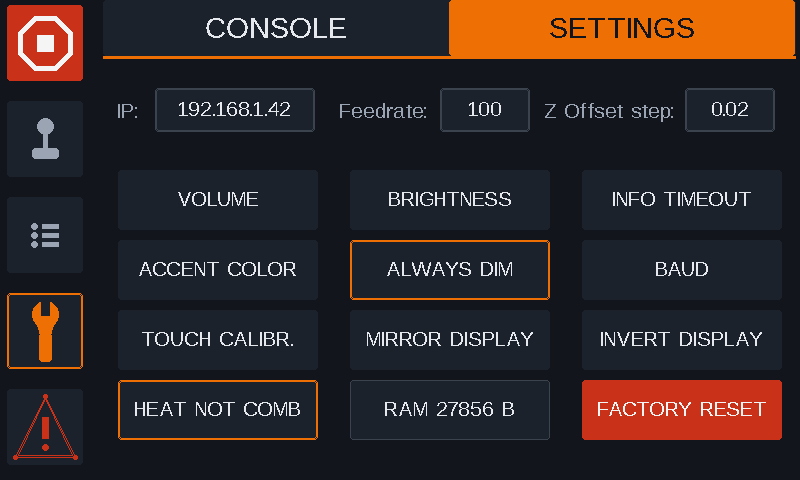

# PanelDue Firmware – Modern UI

This is a fork of the official [Duet 3D PanelDue Firmware](https://github.com/Duet3D/PanelDueFirmware) with a modernized user interface.

Notice: This interface has been coded by Cloude and ChatGtp. I design the interface mockups and layout and then used LLMs for actual coding. So 100% vibe coded. 

## About

PanelDue Firmware – Modern UI provides new firmware interface for PanelDue controllers used with Duet 3D electronics. This fork focuses on updating the PanelDue user experience while retaining the functionality and compatibility of the original project.

## UI
UI follows modern tab design: On the left side top corner we have emergency STOP button Underneath are 3 master tabs and at the bottom left corner is ALERT button shortcut. On the top we have rail with sub tabs that displays tabs that are grouped under each master tab. The rest is content area.

## MASTER TABS

UI is devised in to 3 master sections (TABS) on the left vertical rail.

## CONTROL [Joystic Icon] handles mostly things that are usually done when printer is idle (not printing). Here reside sub tabs TOOLS / MOVE / EXTRUDE / MACROS 

  ### TOOLS

Lists RRF tools, beds and chambers and shows current heater temperature plus active/standby targets. Tapping targets edits       temperatures, tool headers handle tool selection, and the power tile only turns an active heater off. If there are more than 5 heating elements configured (4 toolhead, bed and chamber heater for example) a second page under tools is created with the buttons to navigate between them shown. First page will in this case hold 4 heater columns and 2 most right columns get pushed to second page.      
     
  ### MOVE

Shows live X/Y/Z positions, selectable jog distance and direct X/Y/Z jog controls. Homing buttons reflect RRF homed state and G32 bed compensation is available from the same page.
    
  ### EXTRUDE

Shows the active tool and nozzle temperature, with preset extrusion speeds of 2/5/10/20 mm/s and distances of 10/20/50/150 mm. Retract/extrude actions are blocked unless an active tool exists and its heater meets RRF's cold-extrusion temperature threshold.
    
  ### MACROS

    Displays up to six RRF macro entries per page, with folder navigation and paging. Macro files open a confirmation before execution, while folders open directly.
    

## STATUS [List Icon] handles mostly things that are of interest during printing. Here reside sub tabs PRINTING / TUNE / JOB / OBJECT

  ### PRINTING

    Shows the active print at a glance with job name, progress, slicer thumbnail and a fixed 3×3 read-only telemetry grid. The page also exposes layer/time summary plus the pause/resume and abort actions when a print is active. Two non-tool fans are now identified by their RRF fan names, not by whichever unused fan numbers happen to come first they need to be named like that so paneldue assigns correct tile on printing screen to them.

    
 FAN_AUX → auxiliary fan

 
FAN_CHA → chamber/filter fan
    
  ## TUNE

    Provides live print adjustments for speed, AUX (auxiliary) /  CHA (CHAMBER / FILTER) fans, per-tool part cooling, flow rate and pressure advance adjustments. Z offset is adjusted directly here using the Z off step a amount selected in SETTINGS.
    
  ### JOB

    Displays the printable file list with six rows per page, optional storage-volume selection and page navigation on the right. Selecting a job opens the print-start pop up window, while directories are navigated through the same list view.
    
  ### OBJECT

    Lists object-cancellation targets alongside a live top-view placement map with numbered markers. Objects can be selected by row or map marker, and cancelled objects are shown in the dedicated red state.
    

## SYSTEM [Wrench Icon] houses settings that effect Paneldue dues screen and  printer itself.   Here reside sub tabs CONSOLE / SETTINGS

  ### CONSOLE

    Shows the rolling message log using the proven legacy console layout restyled for the modern 800×480 theme. The keyboard action remains available from the top-right of the content pane for direct command entry.
    
  ### SETTINGS

    Collects core PanelDue device settings such as volume, brightness, timeout, accent colour, baud rate, touch calibration and display orientation. The page also exposes feedrate and Z offset defaults, a live free-RAM monitor and the factory-reset action. Screen dimming function will dim the display to 5% after 180s if no touch is detected. On touch it will go back to set brightness and counter will restart, 

    
## Software Compatibility 

RRF 3.5.2 onward

## Compatible Hardware

Duet3d PanelDue version:

v3-5.0

v3-7.0

v3-7.0c

5.0i

7.0i

## Firmware Downloads

- [PanelDue v3 7.0](last%20versions%20compiled/paneldue-v3-7.0.bin)
- [PanelDue v3 5.0](last%20versions%20compiled/paneldue-v3-5.0.bin)
- [PanelDue v3 7.0c](last%20versions%20compiled/paneldue-v3-7.0c.bin)
- [PanelDue 5.0i](last%20versions%20compiled/paneldue-5.0i.bin)
- [PanelDue 7.0i](last%20versions%20compiled/paneldue-7.0i.bin)

## Repository status

This project is a community-maintained fork. For the latest information about supported hardware, firmware compatibility, building, installation, and configuration, please check the repository documentation and open issues.
Also check Discord. Most of discussion is done there. ( https://discord.gg/mPFXxvBWT )
Firmware / Firmware-forum / NEW UI for old PANEL DUE on RRF 3.6.x

## Original project

- [Duet3D PanelDue Firmware](https://github.com/Duet3D/PanelDueFirmware)
- [Duet3D documentation](https://docs.duet3d.com/)

## License

Please refer to the original project and the license files in this repository for licensing information.
